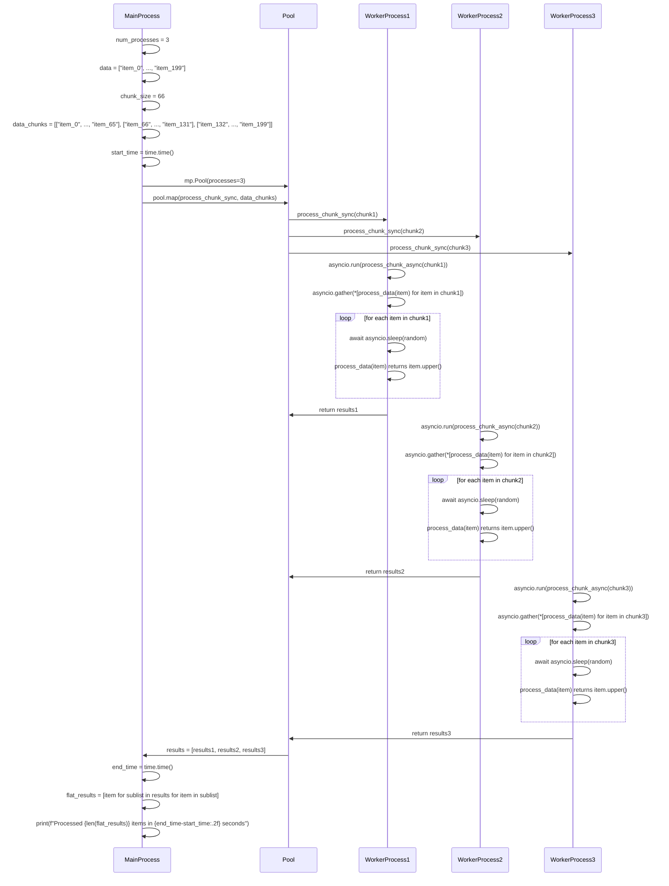
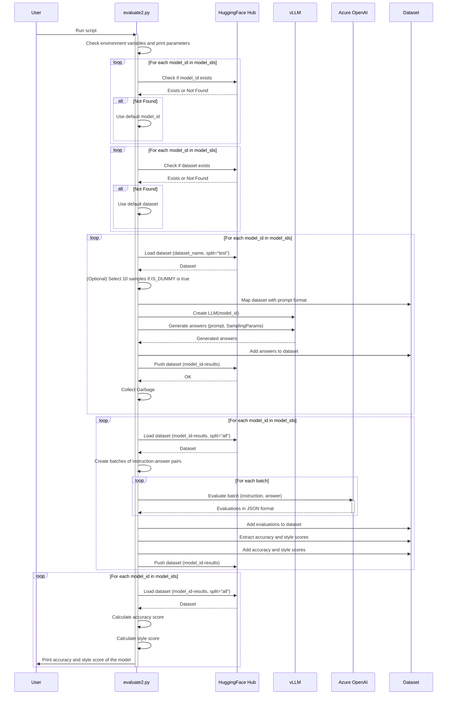

#### Multi-process

```mermaid
sequenceDiagram
    participant MainProcess
    participant Pool
    participant WorkerProcess1
    participant WorkerProcess2
    participant WorkerProcess3
    
    MainProcess->>MainProcess: num_processes = 3
    MainProcess->>MainProcess: data = ["item_0", ..., "item_199"]
    MainProcess->>MainProcess: chunk_size = 66
    MainProcess->>MainProcess: data_chunks = [["item_0", ..., "item_65"], ["item_66", ..., "item_131"], ["item_132", ..., "item_199"]]
    MainProcess->>MainProcess: start_time = time.time()
    MainProcess->>Pool: mp.Pool(processes=3)
    
    MainProcess->>Pool: pool.map(process_chunk_sync, data_chunks)
    
    Pool->>WorkerProcess1: process_chunk_sync(chunk1)
    Pool->>WorkerProcess2: process_chunk_sync(chunk2)
    Pool->>WorkerProcess3: process_chunk_sync(chunk3)

    WorkerProcess1->>WorkerProcess1: asyncio.run(process_chunk_async(chunk1))
    WorkerProcess1->>WorkerProcess1: asyncio.gather(*[process_data(item) for item in chunk1])
    loop for each item in chunk1
        WorkerProcess1->>WorkerProcess1: await asyncio.sleep(random)
        WorkerProcess1->>WorkerProcess1: process_data(item) returns item.upper()
    end
    WorkerProcess1->>Pool: return results1
    
    WorkerProcess2->>WorkerProcess2: asyncio.run(process_chunk_async(chunk2))
    WorkerProcess2->>WorkerProcess2: asyncio.gather(*[process_data(item) for item in chunk2])
    loop for each item in chunk2
        WorkerProcess2->>WorkerProcess2: await asyncio.sleep(random)
        WorkerProcess2->>WorkerProcess2: process_data(item) returns item.upper()
    end
    WorkerProcess2->>Pool: return results2
    
    WorkerProcess3->>WorkerProcess3: asyncio.run(process_chunk_async(chunk3))
    WorkerProcess3->>WorkerProcess3: asyncio.gather(*[process_data(item) for item in chunk3])
    loop for each item in chunk3
        WorkerProcess3->>WorkerProcess3: await asyncio.sleep(random)
        WorkerProcess3->>WorkerProcess3: process_data(item) returns item.upper()
    end
    WorkerProcess3->>Pool: return results3
    
    Pool->>MainProcess: results = [results1, results2, results3]
    MainProcess->>MainProcess: end_time = time.time()
    MainProcess->>MainProcess: flat_results = [item for sublist in results for item in sublist]
    MainProcess->>MainProcess: print(f"Processed {len(flat_results)} items in {end_time-start_time:.2f} seconds")
```
#### ThreadPoolExecutor

```mermaid
sequenceDiagram
    participant User
    participant evaluate2.py
    participant HuggingFace Hub
    participant vLLM
    participant Azure OpenAI
    participant Dataset
    
    User->>evaluate2.py: Run script
    activate evaluate2.py
    evaluate2.py->>evaluate2.py: Check environment variables and print parameters
    loop For each model_id in model_ids
        evaluate2.py->>HuggingFace Hub: Check if model_id exists
        HuggingFace Hub-->>evaluate2.py: Exists or Not Found
        alt Not Found
            evaluate2.py->>evaluate2.py: Use default model_id
        end
    end
    loop For each model_id in model_ids
        evaluate2.py->>HuggingFace Hub: Check if dataset exists
        HuggingFace Hub-->>evaluate2.py: Exists or Not Found
         alt Not Found
            evaluate2.py->>evaluate2.py: Use default dataset
        end
    end
    loop For each model_id in model_ids
        evaluate2.py->>HuggingFace Hub: Load dataset (dataset_name, split="test")
        HuggingFace Hub-->>evaluate2.py: Dataset
        evaluate2.py->>evaluate2.py: (Optional) Select 10 samples if IS_DUMMY is true
        evaluate2.py->>Dataset: Map dataset with prompt format
        evaluate2.py->>vLLM: Create LLM(model_id)
        evaluate2.py->>vLLM: Generate answers (prompt, SamplingParams)
        vLLM-->>evaluate2.py: Generated answers
        evaluate2.py->>Dataset: Add answers to dataset
        evaluate2.py->>HuggingFace Hub: Push dataset (model_id-results)
        HuggingFace Hub-->>evaluate2.py: OK
        evaluate2.py->>evaluate2.py: Collect Garbage
    end
    loop For each model_id in model_ids
        evaluate2.py->>HuggingFace Hub: Load dataset (model_id-results, split="all")
        HuggingFace Hub-->>evaluate2.py: Dataset
        evaluate2.py->>evaluate2.py: Create batches of instruction-answer pairs
         loop For each batch
            evaluate2.py->>Azure OpenAI: Evaluate batch (instruction, answer)
            activate Azure OpenAI
            Azure OpenAI-->>evaluate2.py: Evaluations in JSON format
            deactivate Azure OpenAI
            end
        evaluate2.py->>Dataset: Add evaluations to dataset
        evaluate2.py->>Dataset: Extract accuracy and style scores
        evaluate2.py->>Dataset: Add accuracy and style scores
        evaluate2.py->>HuggingFace Hub: Push dataset (model_id-results)
    end
    loop For each model_id in model_ids
        evaluate2.py->>HuggingFace Hub: Load dataset (model_id-results, split="all")
        HuggingFace Hub-->>evaluate2.py: Dataset
        evaluate2.py->>evaluate2.py: Calculate accuracy score
        evaluate2.py->>evaluate2.py: Calculate style score
        evaluate2.py->>User: Print accuracy and style score of the model
    end
    deactivate evaluate2.py
```